# UAS Semester 1

# Ketentuan Modul

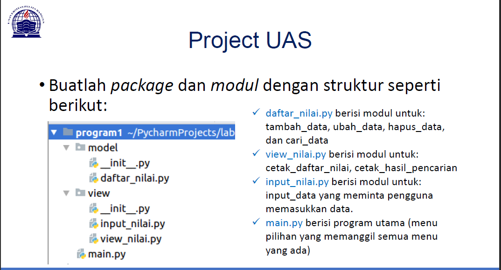

# DAFTAR NILAI

Langkah pertama adalah membuat Python file dengan nama ***daftar_nilai*** pada **model package**.

## Source Code

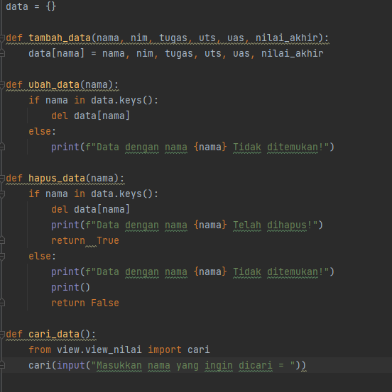

# INPUT NILAI

Selanjutnya adalah membuat Python File dengan nama ***input_nilai*** pada **view package**.

## Source Code

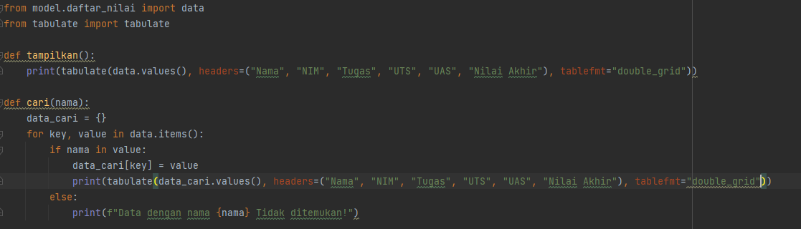

# VIEW NILAI

Selanjutnya adalah membuat Python File dengan nama ***view_nilai*** pada **view package**.

## Source Code

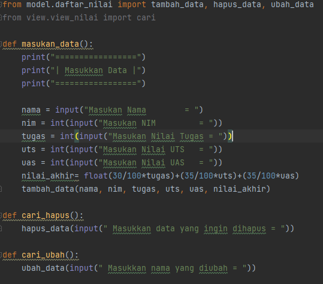

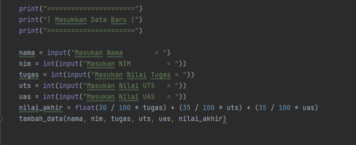

# MAIN

Terakhir adalah membuat ***Main.py*** yang berisi kode program untuk menyatukan semua fungsi yang ada di package

## Source Code

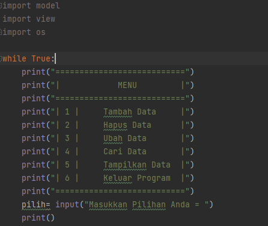

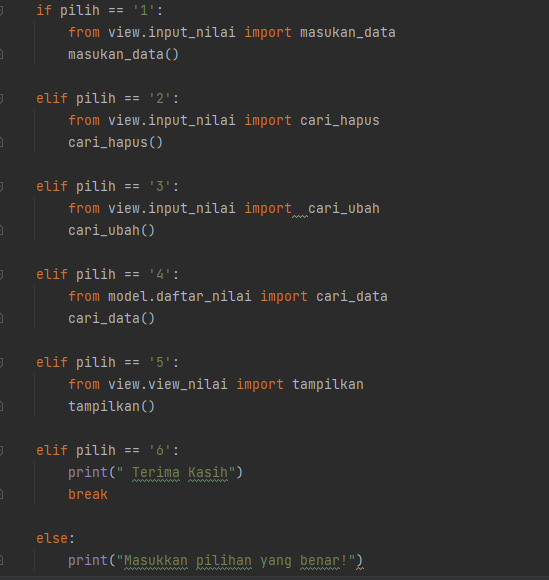

# OUTPUT

> Tambah Data

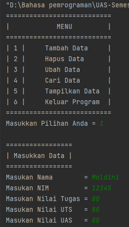

> Tampilkan Data

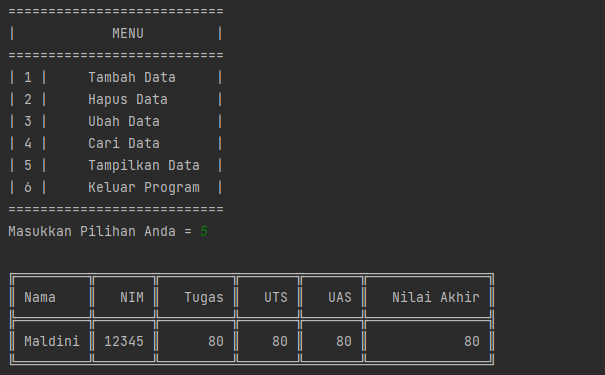

> Ubah Data

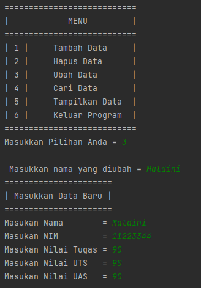

> Tampilkan Data

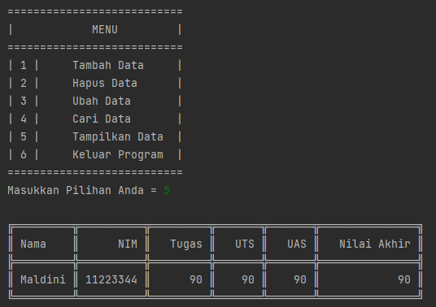
